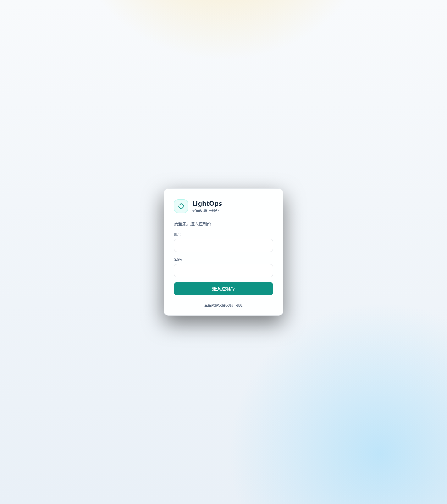
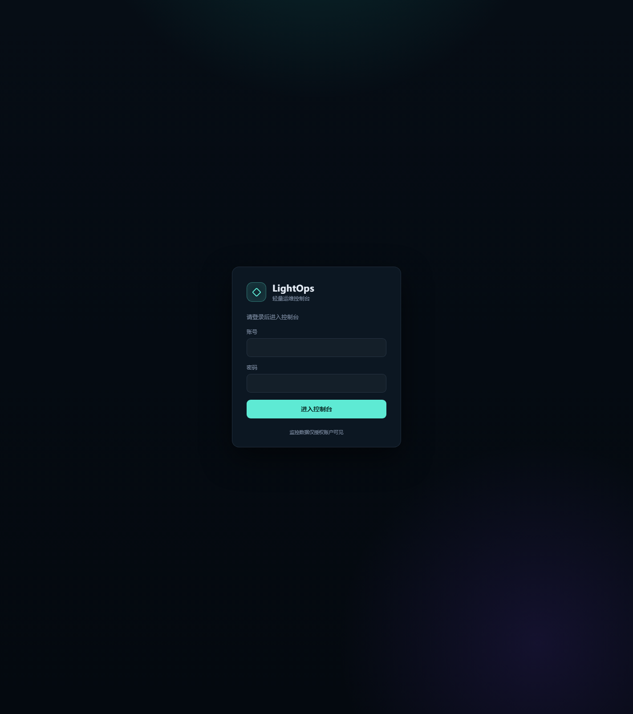
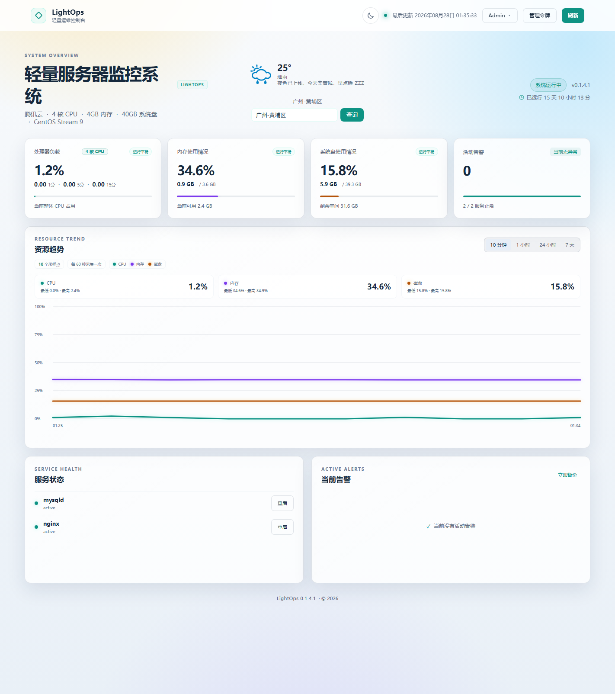
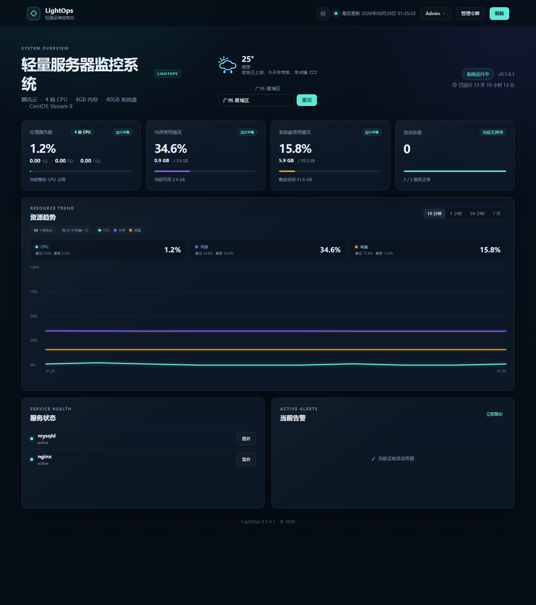
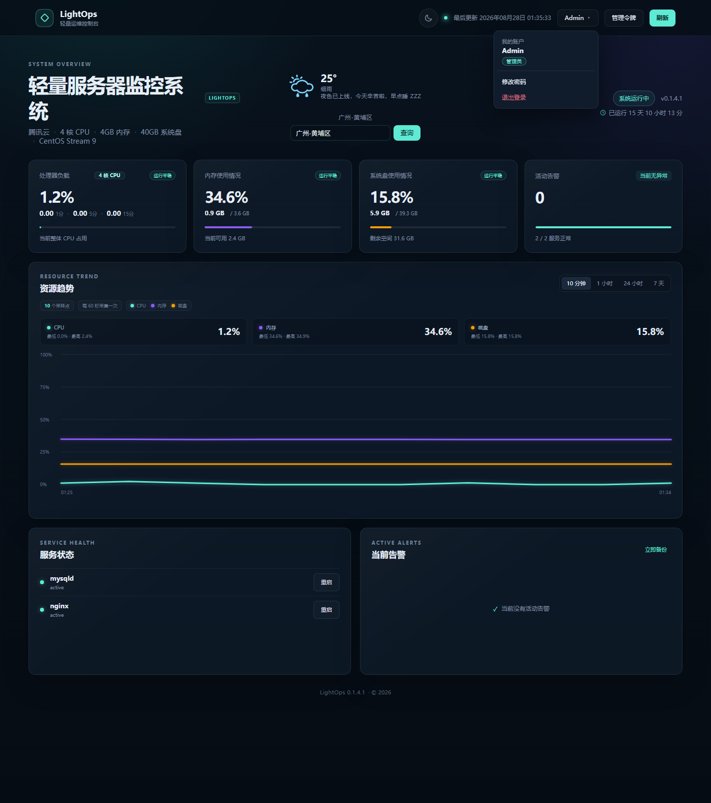

# LightOps

LightOps 是一个轻量的 Linux 服务器监控面板，主要功能：

- 实时监控 CPU、内存、系统盘、负载与网络流量
- 趋势图：10 分钟 / 1 小时 / 24 小时 / 7 天
- 资源超阈值自动告警，恢复后自动解除
- 按城市名查询实时天气（支持区级细化）
- 独立登录页，Admin / Guest 两级权限
- 一键重启白名单服务、一键备份、审计日志
- 日间 / 夜间主题一键切换

技术栈：FastAPI + psutil + APScheduler + SQLite，Vue 3 前端，Nginx + systemd 部署。

## 效果截图

### 登录页

独立登录页

| 日间 | 夜间 |
| :---: | :---: |
|  |  |

### 监控面板

主视图含 hero 标题、实时天气（按城市查询，支持细化到区级）、4 张资源卡（CPU/内存/系统盘/活动告警）、10 分钟/1 小时/24 小时/7 天的三线趋势曲线（CPU/内存/磁盘）、服务健康与活动告警两块；顶栏右侧可见主题切换、立即刷新按钮。

| 日间 | 夜间 |
| :---: | :---: |
|  |  |

### 用户菜单与权限

顶栏用户名按钮下拉：我的账户（带「管理员」角色徽标）、修改密码（独立 modal）、退出登录。重启/备份按钮仅 Admin 可见。

## 系统功能

### 监控面板

- 每 60 秒采集 CPU、内存、系统盘、负载与网络累计流量；
- 资源卡展示 CPU 核数、内存/磁盘"已使用 / 总容量"，阈值分级着色；
- 趋势图支持 10 分钟、1 小时、24 小时、7 天，悬停吸附最近采样点并显示精确数值；
- 服务状态：仅监控安装器识别并写入白名单的 systemd 服务；
- 活动告警：CPU/内存/磁盘超阈值自动产生，恢复后自动解除；
- 城市天气：按城市名查询实时天气，支持细化到区级候选与图标展示。

### 账户与权限

- 独立登录页 ：全新界面，未登录访问面板自动跳转，登录成功回跳；
- 两级角色：**Admin（管理员）** 拥有全部权限，**Guest（访客）** 仅支持查看面板；
- 管理操作（重启服务、立即备份、审计日志）由后端强制门禁：仅管理员（Admin）会话可通行，访客会话一律 403，前端同时隐藏对应按钮；
- 修改密码后所有旧会话立即失效，强制重新登录；
- 密码以 PBKDF2-HMAC-SHA256 哈希存储，登录会话仅保存在当前浏览器标签页（sessionStorage），关闭标签页即失效。

### 运维操作

- 一键重启白名单内的 systemd 服务（经 sudoers 最小白名单授权）；
- 手动触发 SQLite 一致性备份，同时清理超过保留期的历史数据；
- 审计日志记录登录、退出、改密码、重启、备份等关键操作。

### 安全与体验

- 严格 CSP（script-src 'self'，无 unsafe-eval）、Permissions-Policy、隐藏 Nginx 版本号；
- 自定义 404/500 错误页，静态资源 gzip 压缩；
- 日间/夜间主题一键切换：顶栏太阳/月亮按钮带动画切换，偏好写入 localStorage 自动记忆，首次访问跟随系统偏好，登录页同步；
- 键盘焦点、状态播报、减少动画偏好与趋势文本摘要等无障碍支持；
- 前端所有请求 10 秒超时，切换趋势范围时不会出现旧请求覆盖新数据。

## 技术实现思路

### 后端

- **采集与调度**：`collector` 模块用 psutil 读取系统指标，APScheduler（后台线程池）驱动"采集 + 每日维护"两个任务，采集频率与保留期可配置；
- **存储**：SQLite（WAL 模式）单文件存储指标、服务采样、告警、审计日志与用户会话；指标与审计默认保留 7 天，每日 3 点清理过期数据并做一致性备份；
- **认证与授权**：登录签发随机会话 token（7 天有效），密码 PBKDF2 哈希；用户表带 `role` 列区分 admin/guest；管理操作通过 FastAPI 依赖注入 `require_admin_access` 统一门禁——仅 admin 角色会话放行，访客会话 403，无凭证 401；
- **API 设计**：只读数据接口（summary/metrics/services/alerts/weather）不设门槛保证面板可用，写操作集中收口到三个受保护接口，风险面最小。

### 前端

- **零构建发布**：Vue 3 运行时 + `@vue/compiler-dom` 离线预编译的 `render.js`（由 `tools/generate-render.mjs` 从 index.html 生成），发布包不含 CDN 依赖、不含图表库，趋势曲线用原生 SVG 绘制；
- **登录页独立**：`login.html` 使用原生 JavaScript（无 Vue），与面板完全分离，聚焦认证单一职责；
- **状态管理**：登录会话由共享的 `session.js` 读写 sessionStorage，天气偏好同样存 sessionStorage；主题偏好由独立 `theme.js` 集中读写 localStorage（`lightops_theme`），`app.js` 不触碰 localStorage，面板与登录页共享同一套偏好。

### 部署

- **跨发行版自适应**：安装器组合读取 /etc/os-release、PID 1、包管理器、架构、命令实际路径与 systemd unit 后自动选择方案，支持 Ubuntu/Debian 与 RHEL 系（dnf/yum），非 systemd 或容器环境安全停止而非猜测；
- **进程拓扑**：Uvicorn 单 worker 仅监听 127.0.0.1:8000，Nginx 反代到配置端口，systemd `MemoryMax=400M` 限制内存占用；
- **最小权限**：lightops 系统用户 + sudoers 白名单（仅允许重启白名单服务），运行配置存 0640 root:lightops；
- **发布与回滚**：`tools/build-release.py` 确定性构建发布包并计算 SHA-256，升级流程在临时目录预检、备份后安装，失败自动回滚。

## 从 0 到 1 部署项目

先解压源码，进入包含本 README 的目录，以普通用户执行只读预检：

~~~bash
bash deploy/preflight.sh
~~~

只有当输出为： preflight=PASS 时才继续。此系统默认配置可直接使用；若需要改端口、域名显示或服务选择时，修改下面配置：

~~~bash
vi config.env
~~~

然后以 root 权限执行：

~~~bash
bash deploy/install.sh
~~~

安装器将自动识别系统与架构、安装运行依赖、创建 lightops 用户/虚拟环境、生成 Nginx 配置与 sudoers 白名单、启动并做健康检查。安装器不会修改 MySQL/Redis 配置或认证，不会自动修改云安全组/防火墙，也不会默认创建 Swap。

## 修改管理员密码

首次部署后，**Admin（管理员）与 Guest（访客）的初始密码均为 `123456`**，请务必在部署完成后立即修改，尤其是管理员账号。

修改步骤：

1. 打开面板地址，使用 Admin 账号登录；
2. 点击顶栏右侧的用户名按钮，在下拉菜单中选择「修改密码」；
3. 在弹窗中依次输入原密码、新密码并确认，点击提交；
4. 修改成功后提示「密码已更新，请重新登录」，所有旧会话立即失效，需用新密码重新登录。

说明：

- 新密码长度至少 6 位，以 PBKDF2-HMAC-SHA256 哈希存储，数据库中不保存明文；
- Admin 与 Guest 均可通过该入口修改自己的密码，改密码操作会记录到审计日志；
- 若忘记密码，请联系能访问服务器 root 的管理员处理；**目前没有命令行重置密码工具**。

## 可配置项

config.env 中包含全部首次部署选项。常用项：

- LIGHTOPS_PUBLIC_PORT=8080
- LIGHTOPS_SERVER_NAME=_
- LIGHTOPS_PUBLIC_HOST=SERVER_IP
- LIGHTOPS_CLOUD_PROVIDER=auto
- LIGHTOPS_*_SERVICE=auto
- LIGHTOPS_ENABLE_SWAP=0

auto 服务检测候选：

- Nginx：nginx
- MySQL/MariaDB：mysqld、mysql、mariadb
- Redis：redis、redis-server

可选服务未安装时会被忽略。若手工指定了不存在的服务名，安装会失败并说明原因。

## 运行结构

| 资源 | 位置或限制 |
|---|---|
| 应用 | /opt/lightops |
| Python 虚拟环境 | /opt/lightops/.venv |
| SQLite 数据 | /var/lib/lightops/lightops.db |
| 自动备份 | /var/lib/lightops/backups |
| 运行配置 | /etc/lightops/lightops.env，0640 root:lightops |
| 非敏感部署信息 | /etc/lightops/deployment.env |
| systemd unit | /etc/systemd/system/lightops.service |
| Nginx 站点 | /etc/nginx/conf.d/lightops.conf |
| sudoers 白名单 | /etc/sudoers.d/lightops |
| Uvicorn | 仅 127.0.0.1:8000，单 worker |
| systemd 内存上限 | MemoryMax=400M |
| 默认公网入口 | TCP 8080，可配置 |

## 日常操作

~~~bash
lightopsctl status
lightopsctl health
lightopsctl logs 100
lightopsctl restart
lightopsctl backup
lightopsctl nginx-reload
lightopsctl url
sudo lightops-verify
~~~

管理操作一律走 Admin 登录会话，不要再引入任何第二套凭证。不要把 SSH 私钥、MySQL 密码或 Redis 密码粘贴到聊天中。

## 修改前端

离线编译工具已锁定在 tools/package-lock.json：

~~~bash
npm ci --prefix tools
node tools/generate-render.mjs
node --check app/static/render.js
node --check app/static/app.js
~~~

修改 app/static/index.html 后必须重新生成 app/static/render.js。不要手工编辑生成文件，也不要把 CSP 放宽到 unsafe-eval。

## 测试

先在开发虚拟环境安装锁定的运行与测试依赖：

~~~bash
python -m pip install -r requirements-dev.txt
~~~

~~~bash
python -m compileall -q app tests
python tests/smoke.py
python tests/api_smoke.py
python tests/frontend_smoke.py
node --check app/static/app.js
node --check app/static/render.js
bash tests/platform_detection.sh
bash tests/install_helpers.sh
bash tests/nginx_template.sh
bash -n deploy/lib/platform.sh deploy/lib/config.sh deploy/preflight.sh deploy/install.sh
bash -n deploy/lightopsctl deploy/verify-server.sh
~~~

发行版分支测试使用隔离的 /etc/os-release、架构和包管理器夹具，不会修改测试主机。真实发布仍需在目标服务器执行预检、安装和验收。
